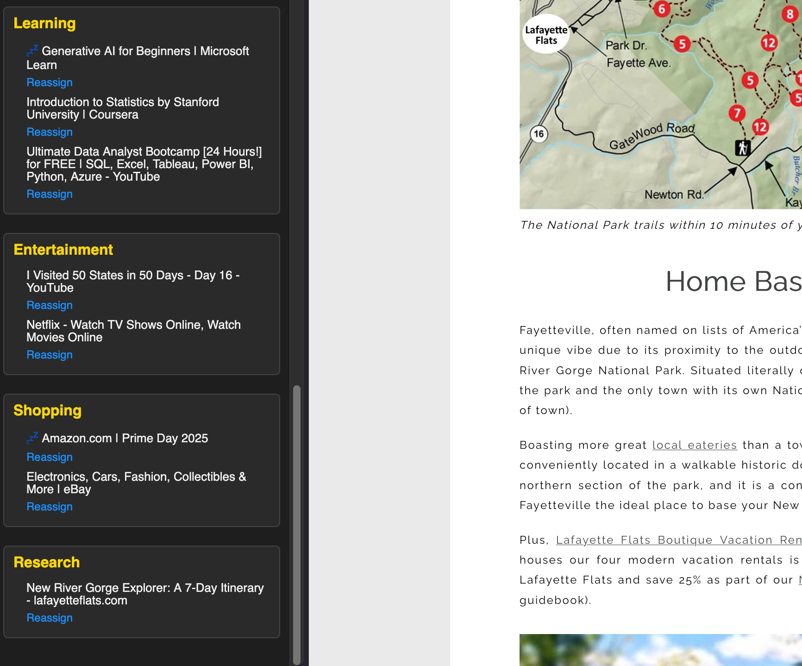

# Contextual Tab Bundler – Firefox Extension

Firefox introduced **vertical sidebars** starting in version **136 (early 2025)**, so I wanted to explore this new feature in Firefox by building a custom extension that makes tab overload more manageable. This extension automatically organizes your open tabs into **topic-based groups** using lightweight AI classification. A more robust AI classification model is in the works.

## Features

- **Automatic Tab Grouping**  
  Tabs are classified into categories like _Research_, _Shopping_, _Learning_, _Entertainment_, and _News_ using smart keywords and domain.

- **Context-Aware AI**  
  Goes beyond simple keyword matching. For example:
  - YouTube videos about tutorials, courses, or lectures are grouped under **Learning**
  - News articles on Amazon are placed under **News**, not **Shopping**

- **Sidebar UI**  
  Groups are displayed in a collapsible vertical sidebar. You can click to activate tabs or manually reassign them.

- **User Reassignment**  
  Easily reassign misclassified tabs to a new group right from the sidebar.

## Installation

1. Go to `about:debugging` → **This Firefox**
2. Click **Load Temporary Add-on**
3. Select any file in the extension folder (e.g., `manifest.json`)
4. The sidebar icon will appear — click it and explore!

## Tech Stack

- Manifest V2 (for Firefox compatibility)
- Vanilla JavaScript
- Cosine similarity vector classification
- Domain and title heuristics for smarter AI behavior

## Compatibility

- Firefox 136+
- Tested on desktop

[]

